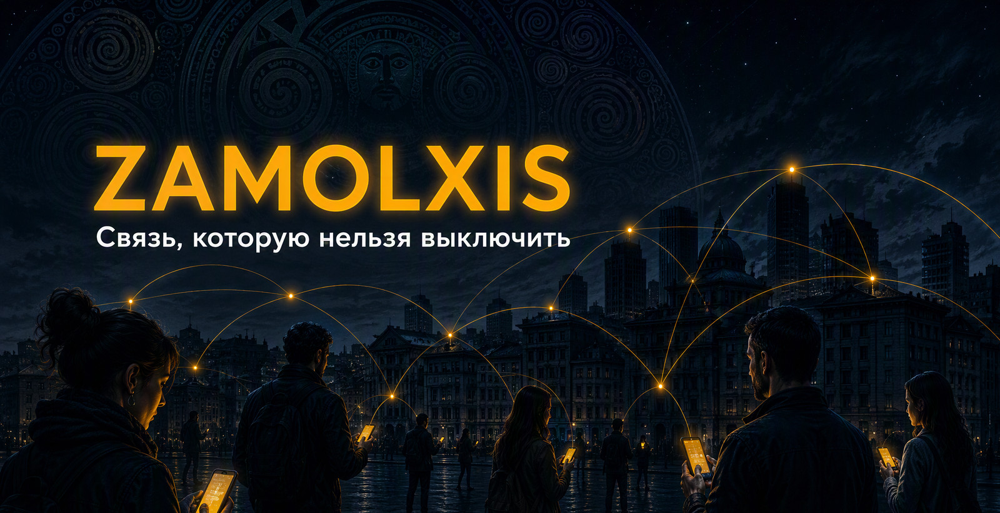
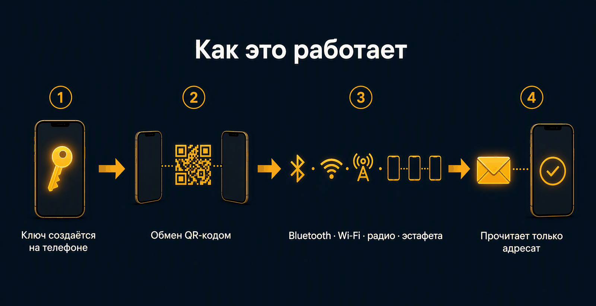
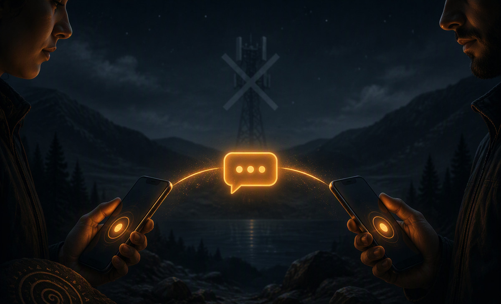
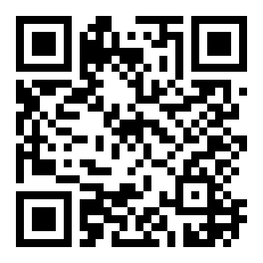

  

# Zamolxis

**Русский | [English](README.en.md) | [Moldovenească](README.mo.md)**

Zamolxis — мессенджер и голосовая связь для Android, который не зависит от интернета, сотовых вышек и каких-либо серверов.
Сообщения и звонки идут напрямую между устройствами через Bluetooth, Wi-Fi, радио (LoRa) или через любые доступные узлы сети Reticulum.

Никаких аккаунтов.
Никаких номеров телефона.
Никакой регистрации.
Нечего блокировать и нечего изымать.

---

  

  

Нажмите, чтобы открыть ролик целиком

---

### Для кого это

- Журналисты и активисты в условиях цензуры или отключений связи
- Люди в экспедициях, удалённых районах и при чрезвычайных ситуациях
- Все, кто не хочет, чтобы личная переписка проходила через чужие серверы

---

### Чем Zamolxis отличается

| Возможность                                 | Обычные мессенджеры | Columba¹     | **Zamolxis**                 |
|---------------------------------------------|---------------------|--------------|------------------------------|
| Работает без интернета                       | Нет                 | Да           | **Да**                       |
| Нет аккаунтов и центральных серверов         | Нет                 | Да           | **Да**                       |
| Постквантовое шифрование                     | Редко               | Нет          | **Да (X25519 + ML-KEM-768)** |
| Переписка зашифрована на устройстве          | Частично            | Нет          | **Да (SQLCipher)**           |
| PIN-блокировка приложения                    | Есть                | Нет          | **Да**                       |
| **Duress PIN** (уничтожение данных)          | Почти нигде         | Нет          | **Да**                       |
| Защита от скриншотов и записи экрана         | Редко               | Нет          | **Да**                       |
| Групповые чаты                               | Да                  | Нет          | **Да**                       |
| Голосовые звонки                             | Да                  | Да           | **Да**                       |
| Офлайн-карты и безопасный обмен геопозицией  | Нет                 | Да           | **Да**                       |

¹ Columba — проект, из кода которого вырос Zamolxis. Сравнение сделано по состоянию upstream на 21 августа 2026 года.

---

### Главные преимущества

**1. Защита от принуждения — Duress PIN**
После установки обычного PIN можно задать второй — аварийный.
Он выглядит точно так же. Если вас заставляют разблокировать приложение, вы вводите аварийный PIN. Все данные безвозвратно уничтожаются, а приложение выглядит как только что установленное. Никаких предупреждений и следов, что существовал второй PIN.

Аварийный PIN работает даже тогда, когда приложение временно заблокировано после неудачных попыток входа — иначе тот, кто отобрал телефон и потыкал наугад, отобрал бы и запасной выход.

**2. Защита от будущего**
Между пользователями Zamolxis сообщения дополнительно запечатываются гибридным постквантовым шифрованием (X25519 + ML-KEM-768). Даже если трафик запишут сегодня, расшифровать его в будущем будет крайне сложно.

По умолчанию это работает в режиме «когда возможно»: печать применяется, если собеседник её понимает и канал способен унести лишние байты — на медленном LoRa-радио они стоят секунд эфирного времени. Тем, кому нужна гарантия, в настройках есть строгий режим: не отправлять вовсе, если запечатать нельзя.

  

**3. Данные под замком**
Вся переписка на телефоне хранится в базе, зашифрованной SQLCipher под ключом из аппаратного хранилища Android. Просто скопировать базу и прочитать её не получится.

**4. Экран под замком**
Скриншоты, запись экрана и трансляция заблокированы, а Android не сохраняет эскиз приложения для меню «Недавних» — иначе заблокированное приложение всё равно показывало бы последнюю переписку каждому, кто смахнёт вверх. Включено по умолчанию, отключается в настройках.

**5. Настоящая автономность**
Работает через Bluetooth рядом с вами, через радио на расстоянии и через любые узлы сети, когда они доступны. Интернет не обязателен.

  

**6. Полное отсутствие следа**
Нет аккаунтов, нет центрального сервера, нет каталога пользователей. Нечего изымать и нечего блокировать.

---

### Что умеет прямо сейчас

- Сообщения и голосовые звонки без интернета
- Групповые чаты
- Duress PIN — аварийное уничтожение данных
- Задержка после неудачных попыток ввода PIN
- Блокировка скриншотов и записи экрана
- Несколько личностей (идентичностей) на одном устройстве
- Безопасный обмен геопозицией и офлайн-карты
- Просмотр страниц NomadNetwork
- Резервное копирование ключей и перенос личности на другой телефон
- Полностью настраиваемый внешний вид

История переписки намеренно **не** покидает устройство: база зашифрована ключом, который никогда не выходит за пределы телефона, поэтому её копия на другом устройстве всё равно не открылась бы. Переносятся ключи и личность, а не сообщения.

---

### Как это работает простыми словами

  

Представьте сеть, в которой телефоны, рации и компьютеры сами находят друг друга и передают сообщения дальше — как живая цепочка.
Не нужен ни один «главный» сервер.

Пропал интернет — связь остаётся.
Отключили вышки — связь остаётся.
Вы в месте без связи — можно использовать радиомодуль.

Zamolxis построен на открытом протоколе [Reticulum](https://reticulum.network/) — одном из самых устойчивых способов связи без централизованной инфраструктуры.

  

---

### Установка

1. Скачайте APK со страницы [Releases](https://github.com/c0d3craft3r13/zamolxis/releases)
2. Обязательно проверьте подпись по инструкции в [SECURITY.md](./SECURITY.md)
3. Установите приложение и создайте свою личность прямо в нём

Или установите через Obtainium:

---

### Безопасность

Zamolxis создан для ситуаций, когда противник может контролировать сеть или физически получить доступ к устройству.

- Сообщения защищены сквозным шифрованием, между пользователями Zamolxis — дополнительно постквантовым
- База данных на устройстве зашифрована
- Есть обычный PIN, задержка после неудачных попыток и **Duress PIN** для уничтожения данных
- Экран защищён от скриншотов, записи и трансляции

Подробная модель угроз и то, что пока **не** покрыто, описаны в [SECURITY.md](./SECURITY.md).

Нашли уязвимость — сообщайте **только** через [GitHub Security Advisories](https://github.com/c0d3craft3r13/zamolxis/security/advisories/new). Никогда не создавайте публичные issues с описанием уязвимостей.

---

### Почему название «Zamolxis»

Zamolxis — бог даков, связанный с бессмертием.
По преданию, он ушёл в подземное жилище на три года, и все считали его мёртвым. А потом вернулся.

Подходящее имя для сети, которая может затихнуть — и снова появиться.

---

### Поддержать проект

Zamolxis полностью бесплатный и с открытым исходным кодом.

**USDT (TRC-20, сеть Tron):**
`TNPzvsfsdNC3XrxJPB2NMVh1nZSPcvZzxC`

  

---

### Лицензия

Mozilla Public License 2.0 — см. [LICENSE.md](./LICENSE.md).

Проект основан на коде [Columba](https://github.com/torlando-tech/columba), но развивается самостоятельно.
Авторы оригинального проекта не связаны с Zamolxis и не поддерживают его.
